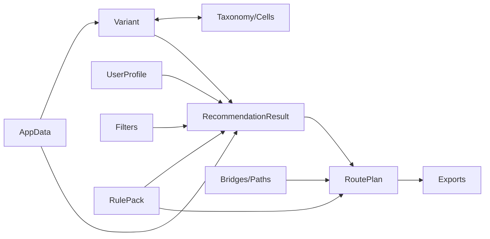

# PROJECTION / BLOCK GRAPH

## Blocks
- **AppData**: dataset + indexes + meta.
- **UserProfile**: location + resources + goal.
- **RulePack (DE)**: rules + compliance kits + reviewed_at + staleness_policy.
- **Variant**: feasibility + economics + legal + tags + taxonomy_id + cells + review_date.
- **Taxonomy/Cells**: 14 mechanisms + 8 cells.
- **Bridges/Paths**: from_cell -> to_cell + steps(outputs) + preconditions.
- **RecommendationResult**: ranked_variants + explanations + diagnostics + profile_hash.
- **RoutePlan**: route_steps + 4-week_plan + aggregated_checklist + artifacts (+ compliance section).
- **Exports**: plan.md + result.json + profile.yaml.

## Graph

## Arrow contracts
- `UserProfile + Filters + AppData + RulePack -> RecommendationResult`: deterministic top-N ranking with per-variant feasibility/economics/legal evaluation and diagnostics.
- `RecommendationResult(selected_variant_id) + Bridges/Paths + RulePack -> RoutePlan`: route plan uses selected variant and includes compliance prep only when compliance_mode permits.
- `RoutePlan -> Exports`: produce `plan.md`, `result.json`, `profile.yaml`.
- `Variant -> recommend eval`: feasibility/economics/legal are evaluated from immutable variant facts.
- `Variant <-> Taxonomy/Cells`, `Variant <-> AppData`: taxonomy/cell and dataset metadata are lookup surfaces, not user edits.

## Invariants (do not mix blocks)
- Variant = facts/data; User mode does not edit feasibility/economics/legal.
- Filters/Preferences = user knobs; affect ranking/selection only.
- RulePack policy: if compliance prep is not accepted/possible, filter variants out during Recommend; if accepted, keep variant and include prep/compliance in RoutePlan.

## Producer / Consumer matrix
| Field | Producer | Consumer |
|---|---|---|
| `profile.location/resources/goal` | Profile UI / profile yaml | recommend, plan, export, UI |
| `variant.feasibility/economics/legal` | `data/variants.yaml` | recommend, variant UI, plan |
| `rulepack.rules/compliance_kits` | `data/rulepacks/DE.yaml` | recommend legal gate, plan compliance, export audit |
| `filters.*` | Variant page / RecommendationResult quick-fixes | recommend, plan warning logic, export audit |
| `selection.selected_variant_id` | Variant list / Recommendation cards | plan, export |
| `route_plan.*` | plan builder | export, RoutePlan UI |

## UI mapping
- **AppData** page: status/validate summary and dataset counters (view).
- **UserProfile** page: edit profile (filter/select disabled here).
- **Variant** page: view variants + set filters + select variant.
- **Taxonomy/Cells** page: browse taxonomy/cells and linked variants (view).
- **Bridges/Paths** page: browse paths with from/to filters (view/filter).
- **RulePack** page: rulepack and compliance kit viewer (view).
- **RecommendationResult** page: run ranking, inspect cards, quick fixes, select variant.
- **RoutePlan** page: build/view plan from selected variant.
- **Exports** page: download plan/result/profile artifacts.

## Recompute triggers
- Profile change -> invalidate RecommendationResult + RoutePlan + Exports.
- Filters change -> invalidate RecommendationResult + RoutePlan + Exports.
- Selected variant change -> invalidate RoutePlan + Exports.
- Data staleness/warnings -> affects RecommendationResult diagnostics and RoutePlan compliance warnings.

## Session state keys
- `profile`: current user profile payload.
- `projection_filters`: centralized filters including compliance mode and thresholds.
- `projection_selection`: selected variant id + selection source.
- `projection_recommendation`: cached recommendation result + cache key.
- `projection_plan`: cached route plan + cache key.
- `export_paths`: latest generated export paths.
